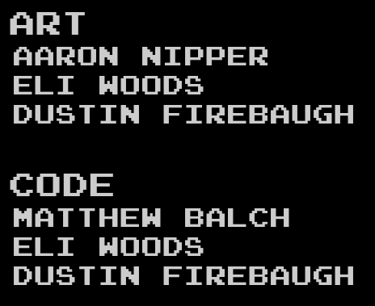

[code](https://github.com/Matt5sean3/moon-defender)

[Moon Defender](https://games.hackrva.org/moon-defender/) is a sweet game made amongst friends over a self imposed game jam that lasted a few weekends.  Why? Well, we simply decided to make a game.

## What's it about?
In a strange dystopian future, aliens of unknown origin have taken a strong interest in our moon.  Most earthlings think the moon is kind of useless and decide that it's not worth saving.  However, one hero stands up for that big bright space tumor in the sky and vowes to defend it.  He is known as "The Moon Defender".

Unfortunately, the moon doesn't have much in the way of defenses.  You play as "The Moon Defender" and man a turret to shoot down the alien scum who so desperately want to steal our moon.

## Contributions

Most of the coding on this project was championed by Matt and Eli.

I contributed some code, art, music, SFX, and ideas.

The music was loosely inspired by a game I played growing up called ["Captain Skyhawk"](https://youtu.be/YGNdTY4vsHU?t=84).

## What could make the game more fun?
The laser (i.e. primary fire) is a bit over used by players.  This is also the easier weapon to use.  It's a direct shot and one hit kill.

If we caused the lasers to overheat after shooting too many times in quick succession, it would force the player to use the old tech (secondary fire) more often.

I thought the gravity effect on the secondary fire was pretty interesting.  It allowed you to hook shoot a projectile around the moon and if you were skilled enough, you could produce a wall of bullets that the aliens just run into.  I guess they are an extremely determined group of aliens.

It would be cool if the secondary fire was an explosive on impact that would cause some AOE damage to nearby enemies.

Upgradeable weapons and power ups...

The story line mode was a little too easy.

## UX Improvements
In story mode, you get a little carried away clicking the alien ships to blast them to oblivion.  However, if the level ends, the cut screen comes up and the control to advance past the cut screen is the same mouse click that you're obliterating enemies with.  So, it's easy to miss the cut screen.  Not that they are particularly high quality cut screens.

## Some Closing Thoughts
There's some value in putting a time limit on a project.  Game jams are great for this (Even self imposed game jams).

Just the fact that we came out of this with something we can call "done" is an achievement on its own.

I'm impressed with the code base (most of which I didn't write).  It's mostly vanilla javascript taking advantage some newish (at the time - 2016) html5 features.  Even today, it looks clean and easily extendable.

Go build something with friends. 10/10 recommend.