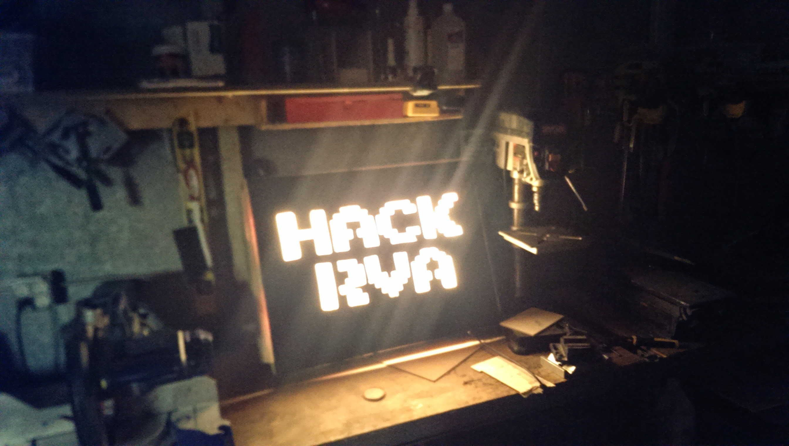

I mention this build in [My Origin Story with HackRVA](/blog/My_HackRVA_Origin_Story)

This was one of my first projects at HackRVA. It's not built well. Rather, it's overbuilt.

I went into HackRVA with almost no skill. Fortunately, I was able to learn a lot over the years.

It's constructed with a 2x4 frame with cabinetry LED inside. Letters were cut out of a sheet of lauan with a jigsaw (aka the poor man's CNC). For some reason there's a mirror inside of it.

Over the years, we got better tools and my skills improved. I like keeping this image around just to look back on.

