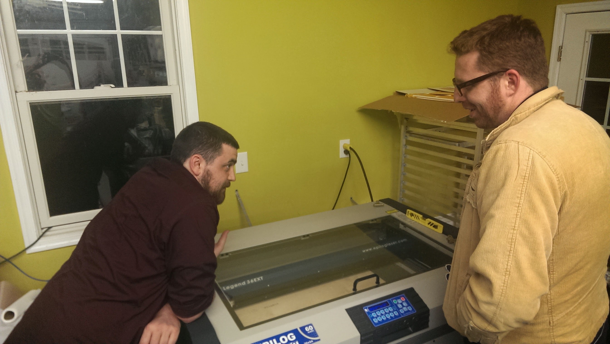
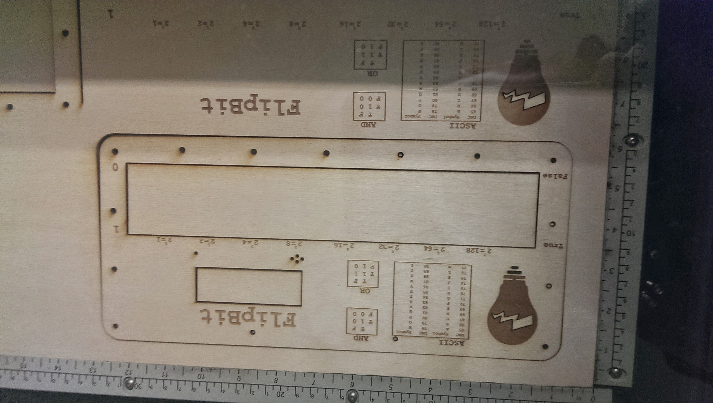
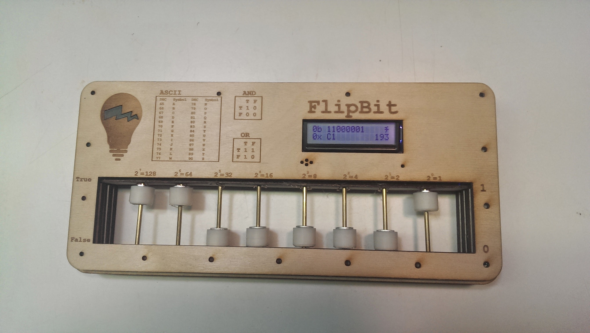

In memory of the FlipBit, I built this quick and dirty webapp. [FlipBit WebApp](https://dfirebaugh.github.io/flipbit/)

The flipbit is a digital binary abacus designed to assist in teaching people the magic of binary conversion.

It was also a bit of an experiment. Teaching someone binary conversion isn't necessarily easy. Some students pick it up quickly and others tend to struggle a bit more. We found that having something that you could hand over to someone so that they could physically interact with it enabled a more conducive learning experience making the concept that the student was trying to [grok](https://en.wikipedia.org/wiki/Grok) made sense.

Building this out was one of those ideas that me and Aaron (then president of HackRVA and good friend of mine) just kicked around for a while. At some point, I think Aaron submitted us into a startup competition with the city's chamber of commerce. We barely had a crude prototype (i.e. a basic series of switches and a small character lcd screen loosely soldered on some [perf board](https://en.wikipedia.org/wiki/Perfboard) (perfboard is kind of terrible btw)). I don't think he expected the project to get nomitated to compete, but we were nominated and very quickly shifted from kicking the idea around to actually figuring out how to make the thing.

We drew up a simple layered design that could be laser cut and etched for the body of the abacus and had it cut out on a laser that someone was nice enough to let us use (at the time HackRVA did not have a laser in working condition).

The beads on the abacus consisted of weirdly shaped 3dprints that housed neodymium magnets. When raising a bead, the magnet would trigger a hall effect sensor. These hall effect sensors were connected to a shift register which ultimately connected back to an arduino. The arduino would display different values on the LCD screen. It could do binary to decimal, binary to hex, binary to ASCII, and logical AND/OR operations.

We built the thing. It wasn't easy but many hands chipped in to provide expertise and labor.

The competition required us to stand in front of 600 people and pitch the device. The experience was a bit nerve racking, but it was nice being surrounded by the energy of people creating. We definitely didn't win, but it was overall a good experience, people seemed to like t he idea, and we made a few good connections.

Here's an article that mentions us in the startup competition: [flipbit startup finalists](https://www.richmond.com/workitrichmond/news/meet-an-i-e-finalist-flipbit/article_dfa5fb0a-be9e-11e3-9ea4-001a4bcf6878.html)

