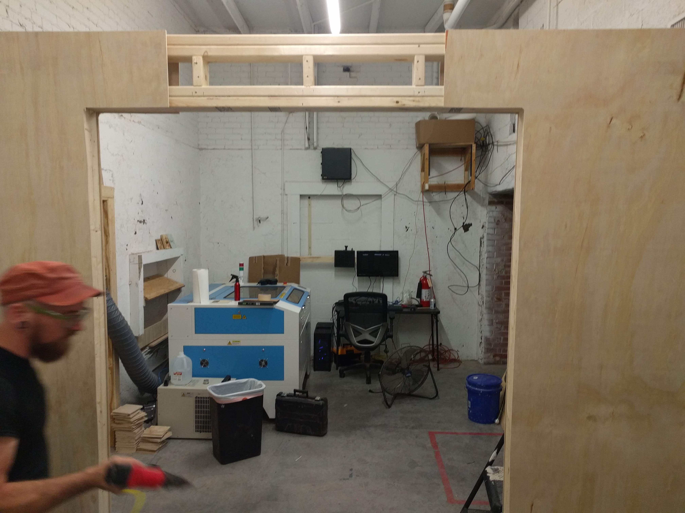
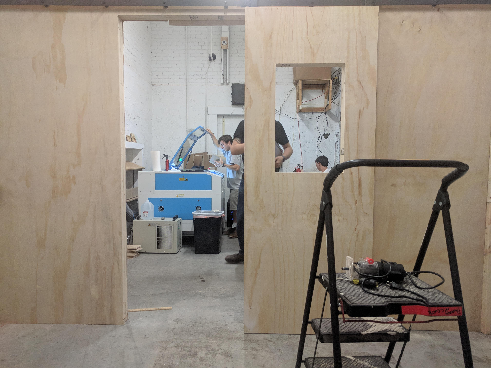
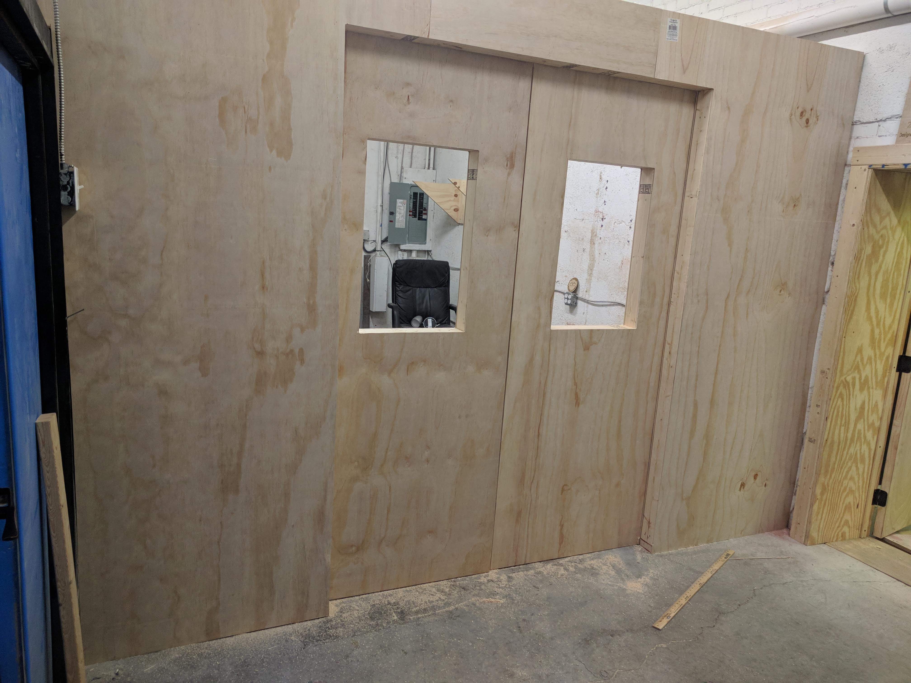
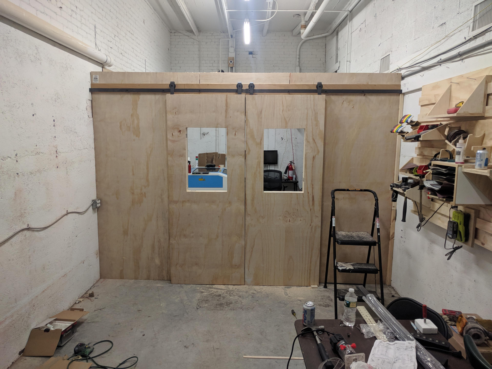

[hackrva's blog](https://www.hackrva.org/blog/2018/06/pardon-our-dust/)

2018 was a big year for HackRVA. We had just [expanded](https://www.hackrva.org/blog/2018/05/tearing-down-the-wall/) the space by renting the additional unit next to us, we purchased a real deal [laser](https://www.hackrva.org/blog/2018/06/new-laser-cutter/), and we had a big [clean up](https://www.hackrva.org/blog/2018/01/project-room-swap-update/) effort to basically redesign the entire space. We attempted to plan out the new space in ways that would make it most ideal for member use. For the first time since I remember, we had a premium on space. We wanted to avoid the "junk corner phenomenon" where things just migrated to a pile just because the space was available. Early on we decided we would benefit from having a classroom/clean space away from the main room which typically serves as a social area. We budgeted a few hundred dollars to purchase tables and chairs and some change to build a partition.

Matt and I tackled the building of the partition and knocked it out in a few hours while listening to Punk Rock across multiple decades!

It's mostly a stick wall made out of 2x3s (2x3s are a bit cheaper than 2x4s) sheethed with some type of thin sheet wood. The doors are also 2x3s mounted on a track. They have a bit of a star trek feel in how they open and close.

The wall mostly serves as a declaration of space.
It basically says, "This space will be used as tables and chairs. That space will be... laser. No ambiguity..."

