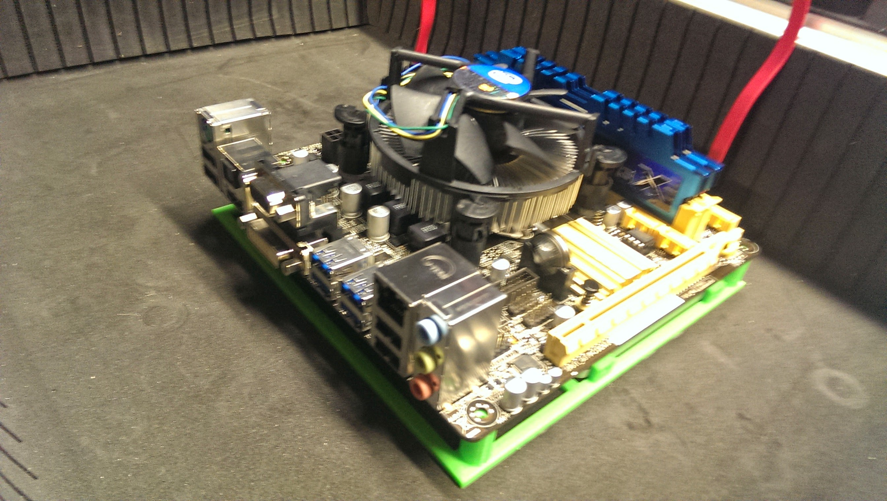
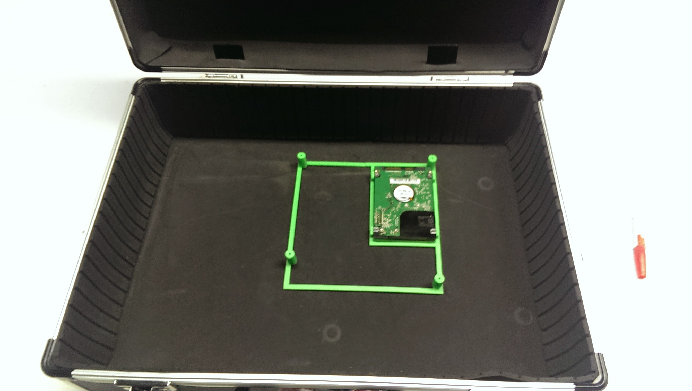
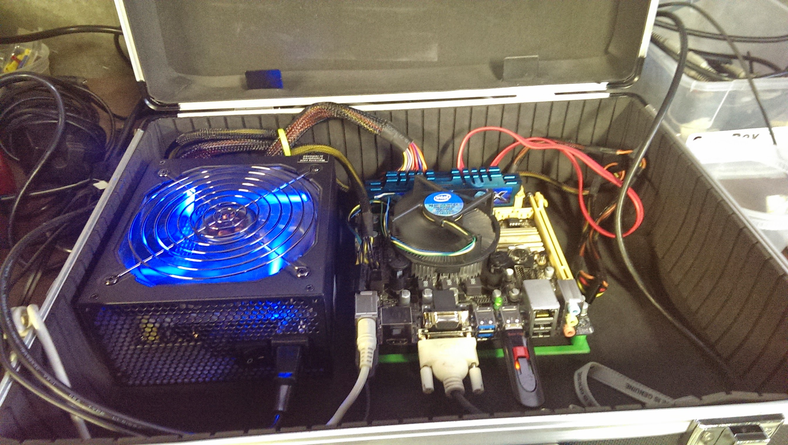

[Luggables](https://en.wikipedia.org/wiki/Portable_computer) are entirely a thing of the past. My current work laptop is thinner than most of my writing utensiles. Everyonce and a while I get a strange urge to put a computer in something.

Sometimes you find yourself in [harbor freight](https://www.harborfreight.com/), a magical place, and you come across an aisle of cheap yet majestic computer cases. I mean, luggage...

This was a fun project. I 3D printed some small standoffs to hold the micro-itx motherboard upand cut a few holes in the side of the case. The hard drive was enclosed underneath the mother board and the powersupply was glued down (not proud of this -- haha).

There was no elegant solution for storage for peripherals (keyboard, mouse, or monitor), but it made for fun hauling around to coffee shops and coworking spaces!

